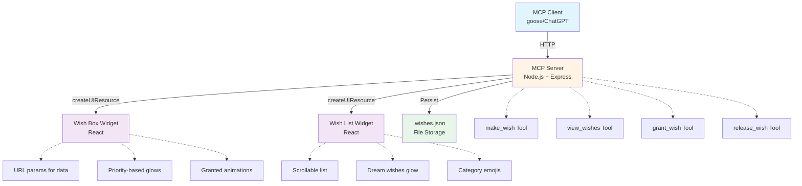

# 🎄 Winter Fairy's Wishbox

A magical [MCP-UI](https://mcpui.dev/) application that brings the Winter Festival's enchanted wishbox to life! Built for [Advent of AI 2025 - Day 17](https://adventofai.com/), this app lets you make wishes, view them in a beautiful UI, grant them when they come true, and release them when needed - all within your MCP client like goose or ChatGPT.

## 📖 The Story

In the center of the Winter Festival stands an ancient, frost-covered mailbox known as the Winter Fairy's Wishbox. For generations, children (and adults too!) have written their wishes on paper and dropped them in, hoping the Winter Fairy would see them. This year, the magic has gone digital! Make wishes, watch them appear in a beautiful enchanted interface, and track them as the Winter Fairy grants them!

## ✨ Features

- **🌟 Make Wishes** - Tell goose your wishes with categories (toy/experience/kindness/magic) and priorities (dream wish/hopeful wish/small wish)
- **📋 View Wishbox** - See all your wishes in a scrollable, magical list with priority-based glowing effects
- **🧚 Grant Wishes** - Mark wishes as granted with sparkling golden animations when they come true
- **🍃 Release Wishes** - Let wishes float away into the winter sky when you're ready to let them go
- **💾 Persistent Storage** - Wishes are saved to disk and preserved across sessions
- **🎨 Magical UI** - Winter-themed styling with glows, gradients, and animations
  - Dream wishes glow brightest with golden auras
  - Granted wishes sparkle with pulsing gold animations
  - Priority-based visual hierarchy
- **React Widgets** - Two beautiful widgets: `wish-box` (single wish) and `wish-list` (all wishes)
- **TypeScript** - Strict mode with ES2023 target
- **Production Ready** - Session management, error handling, graceful shutdown

## 🎯 Quick Start

**Setup time: ~5 minutes**

### Prerequisites

- **[Node.js](https://nodejs.org/) 22+** (required for ES2023 support)
  - Verify: `node -v` (should show v22.0.0 or higher)
- **npm 10+** (ships with Node 22)
  - Verify: `npm -v` (should show v10.0.0 or higher)

**Supported platforms:** macOS, Linux, Windows (via WSL2)

### Installation & Setup

```bash
git clone https://github.com/pomerium/wishlist-mcp
cd wishlist-mcp
npm install
npm run dev
```

This starts both the MCP server and widget dev server:

- **MCP Server**: `http://localhost:8080`
- **Widget Assets**: `http://localhost:4444`

You should see output indicating both servers are running successfully:

```
❯ npm run dev

> wishlist-mcp@1.0.0 dev
> concurrently "npm run dev:server" "npm run dev:widgets"

[1] Found 2 widget(s):
[1]   - wish-box
[1]   - wish-list
[1]
[1]   VITE v6.4.1  ready in 151 ms
[1]   ➜  Local:   http://localhost:4444/

[0] INFO: MCP-UI server started
[0]     port: 8080
[0]     mcpEndpoint: "http://localhost:8080/mcp"
```

### Connect to MCP Client

To use the app in an MCP client (like goose or ChatGPT), expose your local server publicly using [Pomerium's SSH tunnel](https://www.pomerium.com/docs/tcp/ssh):

**1. Create a public tunnel** (in a new terminal, keep `npm run dev` running):

```bash
ssh -R 0 pom.run
```

**First-time setup:**

1. Click the sign-in URL shown in your terminal
2. Sign up and authorize via Pomerium OAuth
3. Your terminal will display your unique public URL

**2. Find your public URL:**

Look for the **Port Forward Status** section showing:
- **Remote**: `https://your-unique-name.pom.run` (your public URL)
- **Local**: `http://localhost:8080`

**3. Add to MCP Client:**

For **goose**:
1. Configure in `~/.config/goose/profiles.yaml`:
```yaml
default:
  provider: anthropic
  processor: anthropic
  accelerator: anthropic
  mcp:
    - url: https://your-unique-name.pom.run/mcp
      name: Winter Wishbox
```

For **ChatGPT**:
1. [Enable ChatGPT apps dev mode](https://platform.openai.com/docs/guides/developer-mode)
2. **Settings → Connectors → Add Connector**
3. Enter: `https://your-unique-name.pom.run/mcp`

**4. Test it:**

Try these commands in your MCP client:
- `"I wish for warm mittens"` - Make a wish
- `"Show me my wishbox"` - View all wishes
- `"My mittens wish came true!"` - Grant a wish
- `"Let go of the mittens wish"` - Release a wish

## 🎨 Available Tools

### `make_wish`
Make a wish and add it to the Winter Fairy's Wishbox!

**Parameters:**
- `message` (required): The wish text
- `category` (optional): `toy`, `experience`, `kindness`, or `magic` (default: `magic`)
- `priority` (optional): `dream wish`, `hopeful wish`, or `small wish` (default: `hopeful wish`)

**Example:**
> "Dear Winter Fairy, I wish for a cozy scarf"

### `view_wishes`
Display all your wishes in a beautiful, scrollable list. Dream wishes glow brighter!

**Example:**
> "Show me my wishbox"

### `grant_wish`
Mark a wish as granted with sparkling golden animations. Uses fuzzy matching to find wishes.

**Parameters:**
- `wish_text` (required): Partial text to match the wish (e.g., "mittens" or "snow wish")

**Example:**
> "My mittens wish came true!"

### `release_wish`
Release a wish from the wishbox, letting it float away. Uses fuzzy matching.

**Parameters:**
- `wish_text` (required): Partial text to match the wish

**Example:**
> "Let go of my first wish"

## 📁 Project Structure

```
wishlist-mcp/
├── server/                  # MCP server
│   ├── src/
│   │   ├── server.ts       # Main server with wish tools
│   │   ├── types.ts        # Type definitions & Zod schemas
│   │   └── utils/
│   │       └── session.ts  # Session management
│   └── package.json
│
├── widgets/                 # React widgets
│   ├── src/
│   │   ├── widgets/
│   │   │   ├── wish-box.tsx   # Single wish display
│   │   │   └── wish-list.tsx  # All wishes display
│   │   ├── components/ui/     # ShadCN components
│   │   └── hooks/
│   │       └── use-tool-output.ts  # MCP-UI data hook
│   └── package.json
│
├── assets/                  # Built widget files
│   ├── wish-box.html
│   ├── wish-list.html
│   └── [hash].js/css files
│
├── .wishes.json            # Persistent wish storage
└── package.json            # Root workspace
```

## 🛠️ Available Commands

### Development

```bash
# Start everything (server + widgets in watch mode)
npm run dev

# Start only MCP server (watch mode)
npm run dev:server

# Start only widget dev server
npm run dev:widgets

# Test with MCP Inspector
npm run inspect
```

### Building

```bash
# Full production build (widgets + server)
npm run build

# Build only widgets
npm run build:widgets

# Build only server
npm run build:server
```

### Testing

```bash
# Run all tests
npm test

# Run server tests only
npm run test:server

# Run widget tests only
npm run test:widgets

# Run tests with coverage
npm run test:coverage
```

### Code Quality

```bash
# Lint all TypeScript files
npm run lint

# Format code with Prettier
npm run format

# Check formatting without modifying
npm run format:check

# Type check all workspaces
npm run type-check
```

### Storybook

```bash
# Run Storybook dev server
npm run storybook

# Build Storybook for production
npm run build:storybook
```

## 🎭 Example Conversation

```
You: "Dear Winter Fairy, I wish for a cozy scarf"

goose: ✨ Wish added to the Winter Fairy's Wishbox!
🌟 Wish: a cozy scarf
📦 Category: magic
💫 Priority: hopeful wish

[Beautiful wish-box widget appears with winter styling]
```

```
You: "Show me all my wishes"

goose: ✨ Your Winter Fairy Wishbox contains 3 wishes!

[Scrollable wish-list widget appears showing:
- 🌟 A cozy scarf (hopeful wish) - awaiting magic
- 💝 Spread kindness (kindness, small wish)
- 💫 Snow on Christmas (experience, dream wish) - glowing brightest!]
```

```
You: "My scarf wish came true!"

goose: 🌟✨ WISH GRANTED! ✨🌟

💫 "a cozy scarf" has been granted by the Winter Fairy!
🎉 Granted at: [timestamp]

[Wish-box widget appears with golden pulsing glow and "GRANTED" badge]
```

## 🏗️ Architecture



## 🎨 Visual Features

### Priority-Based Glows
- **Dream Wish** 💫: Brightest golden glow with pulsing animation
- **Hopeful Wish** ⏳: Medium purple glow
- **Small Wish** 🌙: Soft blue glow

### Categories
- **Toy** 🎁: For physical gifts and toys
- **Experience** ✨: For adventures and experiences
- **Kindness** 💝: For spreading love and kindness
- **Magic** 🌟: For magical and mystical wishes

### Granted Wishes
- Golden gradient background
- Pulsing star emoji ⭐
- "GRANTED" badge with golden border
- Enhanced shadow and glow effects
- Timestamp of when granted

## 🔧 Configuration

Create `.env` file (see `.env.example`):

```bash
# Server
NODE_ENV=development
PORT=8080
LOG_LEVEL=info

# Widget Development
WIDGET_PORT=4444

# Session Management
SESSION_MAX_AGE=3600000  # 1 hour
```

## 🎁 What's Implemented

✅ All core requirements from Day 17 specs:
- Make wishes with categories and priorities
- View all wishes in beautiful UI
- Grant wishes with sparkling effects
- Release wishes from the wishbox
- Fuzzy text matching for grant/release
- Dream wishes glow brighter
- File persistence across sessions

✅ Bonus features:
- Wish categories with unique emojis
- Priority levels with different visual effects
- Extra magical UI with gradients, glows, animations
- Encouraging Winter Fairy messages
- Scrollable wish list (600px max height)
- Granted wish timestamps
- Production-ready error handling

## 📚 Learn More

- [MCP-UI Documentation](https://mcpui.dev/)
- [Model Context Protocol](https://modelcontextprotocol.io/)
- [Advent of AI 2025](https://adventofai.com/)
- [goose AI Assistant](https://github.com/square/goose)

## 🎄 License

MIT

---

Made with ✨ magic ✨ for the Winter Festival
